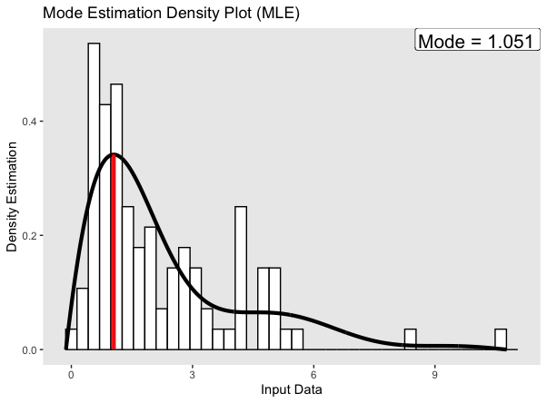

# exdiff

**Ex**trema Inference via **Diff**eomorphisms

Extrema points, more specifically modes, are useful summary statistics for probability distributions, specifically those that are heavily skewed or concentrated around a specific point. This package offers functionalities to infer the mode of continuous, unimodal distributions. We offer functions that obtain a point estimate via an MLE procedure and allow the user to perform uncertainty quantification of the mode via Bayesian posterior inference.

To estimate the mode, we utilize a procedure introduced by Dasgupta et al. (2021) (paper linked [here](https://www.tandfonline.com/doi/full/10.1080/00401706.2020.1867647)). Here, they prove that every unimodal probability distribution within a compact interval that has 0 density on the boundaries can be estimated by applying a continuous increasing function called a diffeomorphism to the input space of another probability distribution that satisfies the same constraints. This diffeomorphism can be estimated by applying a special mapping to a truncated cosine basis $$ \sum_{i = j}^{k}\sqrt{2} \beta{j}\text{cos}(\pi j x) $$In this package, we first estimate the pdf by finding a proper diffeomorphism, and thus the beta weights of best fit, to apply to a probability distribution obtained by [cubic interpolation](https://en.wikipedia.org/wiki/Cubic_Hermite_spline#Interpolation_on_a_single_interval) with mode at the center of the range. Then, the mode can be inferred by applying the inverse diffeomorphism to that center.

## Installation

To install the package, copy this code into your R console

```         
library(devtools)
devtools::install_github('mprice747/exdiff')
```

## Usage

To load the package, copy this code into your R console or script

```         
library(exdiff)
```

exdiff offers the ability to obtain point estimates of the mode through an MLE optimization process. The main hyperparameter the user needs to supply is num_betas, which must be a positive integer greater then 1. This refers to the number of weights for the cosine basis, where a greater a number may lead to overfitting. In general, 2 or 3 should be plenty for most applications. By calling **diffeo_mle_estimate**, the user has the option to see a plot of the results, displayed below.

```         
set.seed(2)
X1 <- rgamma(100, 2, 1)
mle_X1 <- diffeo_mle_estimate(X1, num_betas = 2, plot_results = TRUE)
```



To obtain Bayesian samples of the mode, and thus perform uncertainty quantification, one must call the **diffeo_bayes_estimate** function. Here, the posterior is estimated via the adaptive MCMC procedure from the **adaptMCMC** package. The user will also receive point estimates via a MAP estimation procedure. Again, the main hyperparameter is num_betas, but the user also has options to tweak the prior distribution and MCMC sampler.

```         
bayes_X1 <- diffeo_bayes_estimate(X1, 2, num_samples = 5000, prior_sd = 0.75, plot_results = TRUE)
```


The user can also explore the likelihood function used for estimate with the **diffeo_log_likelihood** function. For more details about this likelihood, see paper linked above.

```         
beta_estimate <- mle_X1$final_beta
b_vec <- c(0, 0.5, 1)
lambda_vec <- c(0, 1, 0)
log_like_X1 <- diffeo_log_likelihood(X1, Beta = beta_estimate, b_vec = b_vec, lambda_vec = lambda_vec)
```

## Contact

This package is authored and maintained by Michael Price (mprice\@tamu.edu)
